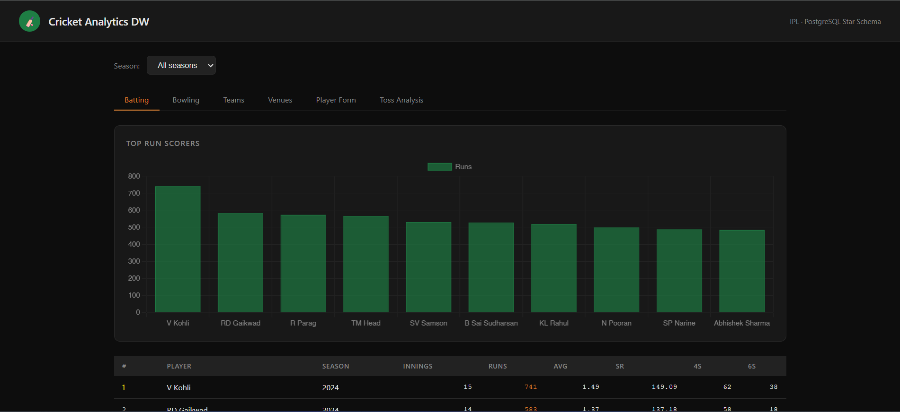

# 🏏 IPL Analytics Dashboard

An end-to-end cricket analytics pipeline for Indian Premier League data — ETL from raw CSVs, a PostgreSQL star schema data warehouse, and an interactive Flask dashboard to explore batting, bowling, team, venue, and toss statistics.

---

## 📸 Preview



---

## 🎬 Video Walkthrough

> A full demo of the dashboard in action:

https://drive.google.com/file/d/1ZKMjIP9yH5-idURXiHW1p7QD355-fe8w/view?usp=sharing

> **Tip:** GitHub doesn't play MP4s inline. For the best experience, either download the video or host it on YouTube and embed the thumbnail link below:

[](https://drive.google.com/file/d/1ZKMjIP9yH5-idURXiHW1p7QD355-fe8w/view?usp=sharing)

---

## ✨ What It Does

- **Batting tab** — top run scorers, averages, strike rates, 4s and 6s across seasons
- **Bowling tab** — wicket takers, economy rates, bowling averages
- **Teams tab** — win/loss records and team performance trends
- **Venues tab** — ground-wise match stats and scoring patterns
- **Player Form tab** — recent form tracking per player
- **Toss Analysis tab** — toss decision impact on match outcomes
- **Season filter** — slice all views by a specific IPL season or view all-time

---

## 🗂️ Project Structure

```
IPL_ANALYTICS/
├── data/
│   ├── deliveries.csv          # Ball-by-ball delivery records
│   └── matches.csv             # Match-level metadata
├── etl/
│   └── load_data.py            # ETL — reads CSVs and loads into PostgreSQL
├── sql/
│   ├── schema/
│   │   ├── 01_create_dims.sql  # Dimension tables (players, teams, venues)
│   │   └── 02_create_facts.sql # Fact tables (deliveries, match results)
│   ├── analytics/
│   │   ├── views.sql           # Dashboard views
│   │   └── resume_queries.sql  # Ad-hoc analytics queries
│   └── stored_procs/
│       └── sp_player_and_match.sql  # Player + match summary procedures
├── dashboard/
│   ├── app.py                  # Flask app entrypoint
│   └── templates/
│       └── dashboard.html      # Jinja2 dashboard template
└── requirements.txt
```

---

## 🚀 Getting Started

### Prerequisites
- Python 3.11+
- PostgreSQL (running locally or via Docker)

### 1. Clone the repo

```bash
git clone https://github.com/your-username/ipl-analytics.git
cd ipl-analytics
```

### 2. Create and activate a virtual environment

```bash
python -m venv venv

# Windows
.\venv\Scripts\Activate.ps1

# macOS / Linux
source venv/bin/activate
```

### 3. Install dependencies

```bash
pip install -r requirements.txt
```

### 4. Configure environment variables

Create a `.env` file in the project root:

```env
DB_HOST=localhost
DB_PORT=5432
DB_USER=your_user
DB_PASSWORD=your_password
DB_NAME=ipl_analytics
```

### 5. Set up the database schema

Run the DDL scripts against your PostgreSQL instance:

```bash
psql -U your_user -d ipl_analytics -f sql/schema/01_create_dims.sql
psql -U your_user -d ipl_analytics -f sql/schema/02_create_facts.sql
psql -U your_user -d ipl_analytics -f sql/analytics/views.sql
```

### 6. Load the data

```bash
python etl/load_data.py
```

### 7. Start the dashboard

```bash
python dashboard/app.py
```

Open `http://127.0.0.1:5000/` in your browser.

---

## 🐳 Running with Docker (recommended for quick start)

```bash
# Start a local Postgres instance
docker run --name ipl-postgres \
  -e POSTGRES_USER=ipl \
  -e POSTGRES_PASSWORD=ipl \
  -e POSTGRES_DB=ipl_analytics \
  -p 5432:5432 -d postgres:15

# Then follow steps 5–7 above
```

---

## 🗃️ Data Model

The warehouse uses a **star schema**:

```
dim_player ──┐
dim_team   ──┤──► fact_deliveries ◄── dim_match ◄── dim_venue
dim_season ──┘
```

- `fact_deliveries` — one row per ball bowled (runs, wickets, extras)
- `dim_match` — match metadata (date, teams, venue, toss, result)
- `dim_player`, `dim_team`, `dim_venue`, `dim_season` — lookup dimensions

---

## 📊 Dashboard Tabs

| Tab | What it shows |
|---|---|
| Batting | Top run scorers, avg, SR, 4s, 6s |
| Bowling | Top wicket takers, economy, avg |
| Teams | Win rates, head-to-head records |
| Venues | Ground stats, avg first innings scores |
| Player Form | Recent match-by-match performance |
| Toss Analysis | Toss decision vs match outcome |

---

## 📋 Requirements

```
flask>=3.0.0
psycopg2-binary>=2.9.9
pandas>=2.1.0
python-dotenv>=1.0.0
```

---

## 🤝 Contributing

1. Fork the repo
2. Create a feature branch (`git checkout -b feature/new-analytics`)
3. Add queries in `sql/analytics/` or extend `dashboard/app.py`
4. Open a pull request

When adding new analytics, define them as SQL views in `views.sql` first, then expose them via a new Flask route.

---

## ⚠️ Notes

- Data source is public IPL ball-by-ball data — confirm licensing before redistributing
- No test suite is included yet — contributions welcome
- SQLite can be used instead of PostgreSQL for local prototyping (adjust connection code and DDL)
